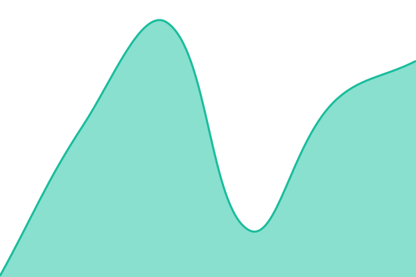

# aikka status

Public status page for the aikka platform and PharmaGEO, run by [Upptime](https://upptime.js.org).

- Status page: https://status.aikka.ai/
- Checks run every 5 minutes from GitHub Actions. Each outage opens an issue in this repository, which is closed automatically on recovery.
- Configuration lives in [`.upptimerc.yml`](.upptimerc.yml). Change it through a pull request.

<!--start: status pages-->
<!-- This summary is generated by Upptime (https://github.com/upptime/upptime) -->
<!-- Do not edit this manually, your changes will be overwritten -->
<!-- prettier-ignore -->
| URL | Status | History | Response Time | Uptime |
| --- | ------ | ------- | ------------- | ------ |
|  [aikka website](https://aikka.ai) | 🟩 Up | [aikka-website.yml](https://github.com/Aikka-ai/status/commits/HEAD/history/aikka-website.yml) | 

 140ms
     
 | 

<a href="https://status.aikka.ai/history/aikka-website">100.00%</a>
    

|  [aikka platform API](https://api-aikka-store-back-prod.aikka.ai/health) | 🟩 Up | [aikka-platform-api.yml](https://github.com/Aikka-ai/status/commits/HEAD/history/aikka-platform-api.yml) | 

 626ms
     
 | 

<a href="https://status.aikka.ai/history/aikka-platform-api">94.70%</a>
    

|  [aikka data API](https://api-aikka-data-prod.aikka.ai/health) | 🟩 Up | [aikka-data-api.yml](https://github.com/Aikka-ai/status/commits/HEAD/history/aikka-data-api.yml) | 

 655ms
     
 | 

<a href="https://status.aikka.ai/history/aikka-data-api">100.00%</a>
    

|  [PharmaGEO website](https://pharma-geo.com) | 🟩 Up | [pharmageo-website.yml](https://github.com/Aikka-ai/status/commits/HEAD/history/pharmageo-website.yml) | 

 416ms
     
 | 

<a href="https://status.aikka.ai/history/pharmageo-website">100.00%</a>
    

|  [PharmaGEO application](https://app.pharma-geo.com) | 🟩 Up | [pharmageo-application.yml](https://github.com/Aikka-ai/status/commits/HEAD/history/pharmageo-application.yml) | 

 470ms
     
 | 

<a href="https://status.aikka.ai/history/pharmageo-application">100.00%</a>
    

|  [PharmaGEO API](https://api.aikka-pharma.com/health) | 🟩 Up | [pharmageo-api.yml](https://github.com/Aikka-ai/status/commits/HEAD/history/pharmageo-api.yml) | 

 651ms
     
 | 

<a href="https://status.aikka.ai/history/pharmageo-api">100.00%</a>
    

<!--end: status pages-->
